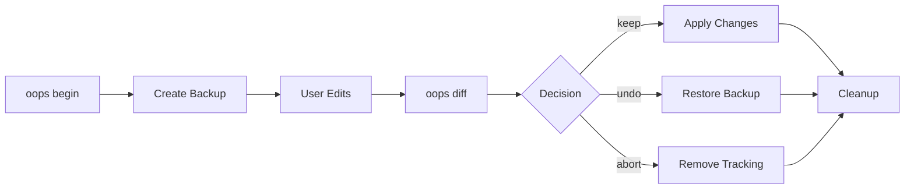

# Oops Architecture Documentation

## Design Philosophy

Oops follows a **simplicity-first** approach to safe text editing. Unlike complex version control systems, Oops focuses on a single workflow: **backup → edit → decide**.

### Core Principles

- **Single Purpose**: Safe text file editing only
- **Zero Learning Curve**: Intuitive commands that match mental models
- **Atomic Operations**: All-or-nothing changes to prevent corruption
- **Workspace Isolation**: Each project operates independently
- **Git Foundation**: Leverages proven Git infrastructure without exposing complexity

## System Architecture

```
┌─────────────────────────────────────────────────────────┐
│                    CLI Interface                        │
├─────────────────────────────────────────────────────────┤
│               Command Processors                        │
├─────────────────────────────────────────────────────────┤
│             Core Business Logic                         │
├─────────────────────────────────────────────────────────┤
│          File Operations & Git Abstraction              │
├─────────────────────────────────────────────────────────┤
│              File System & Git                          │
└─────────────────────────────────────────────────────────┘
```

## Core Components

### 1. CLI Interface Layer
**Purpose**: Minimal argument parsing and user interaction

**Key Files**:
- `cli/index.js` - Main entry point
- `cli/output.js` - Consistent output formatting
- `cli/prompts.js` - Safety confirmations

**Design**: 
- Zero external CLI frameworks
- Direct argument parsing for speed
- Consistent output patterns

### 2. Command Processors
**Purpose**: Command-specific logic and validation

**Commands** (12 total):
- **Core**: `init`, `begin`, `diff`, `keep`, `undo`, `abort`
- **Utility**: `status`, `clean`, `config`, `which`, `help`, `list`

**Pattern**:
```javascript
class Command {
  async validate(args) { /* Pre-checks */ }
  async execute(args) { /* Main logic */ }
  async cleanup(error) { /* Error handling */ }
}
```

### 3. Core Business Logic
**Purpose**: Orchestrates file operations and maintains state

**Services**:
- `FileTracker` - Manages tracking state
- `BackupManager` - Handles backup/restore operations  
- `WorkspaceManager` - Manages workspace lifecycle
- `DiffProcessor` - Generates diffs and summaries

### 4. File Operations Layer
**Purpose**: Abstracts file system and Git operations

**Components**:
- `FileSystem` - Safe file operations
- `GitWrapper` - Simplified Git interface
- `ConfigManager` - Configuration handling
- `PathResolver` - Cross-platform path handling

## Data Flow

### File Tracking Lifecycle



### Workspace Structure

```
.oops/                    # Workspace root
├── config.json            # Local configuration
├── state.json             # Tracking state
└── files/                 # Per-file tracking
    └── <file-hash>/        # Isolated file tracking
        ├── .git/           # Git repository
        ├── backup          # Original file backup
        └── metadata.json   # File-specific metadata
```

## File System Design

### Workspace Location Strategy

1. **Local Mode** (default): `.oops/` in current directory
2. **Temp Mode**: `$TMPDIR/oops-<project-hash>/`
3. **Explicit Mode**: User-specified path

### Path Resolution Priority

```
1. --workspace CLI option
2. KEEPER_WORKSPACE environment variable  
3. Local .oops/ directory (if exists)
4. Parent directory search (up to 5 levels)
5. Configuration workspace.path setting
6. Default: current directory
```

### Cross-Platform Temp Directories

**Windows**: `%TEMP%\oops-<hash>\`  
**Unix/Linux**: `${TMPDIR:-/tmp}/oops-<hash>/`  
**macOS**: `$TMPDIR/oops-<hash>/`

Hash is generated from current working directory to ensure consistency.

## Safety Mechanisms

### 1. Atomic Operations
All file operations are wrapped in transactions:

```javascript
class Transaction {
  constructor() {
    this.operations = [];
    this.rollbackActions = [];
  }
  
  async execute() {
    try {
      for (const op of this.operations) {
        const rollback = await op.execute();
        this.rollbackActions.unshift(rollback);
      }
    } catch (error) {
      await this.rollback();
      throw error;
    }
  }
}
```

### 2. Backup Strategy
- **Primary backup**: Created during `begin`
- **Pre-undo backup**: Current state saved before `undo`
- **Final backup**: Snapshot before `keep` (optional)

### 3. Integrity Checks
- File existence validation
- Permission verification
- Git repository health checks
- Workspace consistency validation

### 4. Error Recovery
- Automatic rollback on failure
- Corrupted workspace detection
- Self-healing workspace repair
- Graceful degradation

## Git Integration

### Simplified Git Usage
Oops uses Git for reliability but hides complexity:

```javascript
class GitWrapper {
  async init(path) {
    await this.exec(['init', '--quiet'], { cwd: path });
  }
  
  async backup(file, message = 'Initial backup') {
    await this.exec(['add', file]);
    await this.exec(['commit', '-m', message]);
  }
  
  async diff(file) {
    return await this.exec(['diff', 'HEAD', file]);
  }
}
```

### Git Repository Per File
Each tracked file gets its own Git repository for:
- **Isolation**: Files don't interfere with each other
- **Simplicity**: No branch management needed
- **Performance**: Smaller repositories are faster
- **Cleanup**: Easy to remove when done

## Configuration System

### Configuration Hierarchy
1. CLI arguments (highest priority)
2. Environment variables
3. Local config (`.oops/config.json`)
4. Global config (`~/.oops/config.json`)
5. Default values (lowest priority)

### Core Settings
```json
{
  "workspace": {
    "useTemp": false,
    "path": null
  },
  "safety": {
    "confirmKeep": true,
    "confirmUndo": true,
    "autoBackup": true
  },
  "diff": {
    "tool": "auto",
    "context": 3
  }
}
```

## Performance Considerations

### Optimization Strategies
- **Lazy initialization**: Components load on-demand
- **Minimal Git operations**: Only essential Git commands
- **Efficient file handling**: Stream processing for large files
- **Workspace caching**: Reuse workspace validation

### Scalability Limits
- **File size**: Optimized for files up to 50MB
- **Concurrent files**: Reasonable limit of 100 tracked files
- **Workspace lifetime**: Auto-cleanup after 7 days

## Error Handling

### Error Categories
```javascript
class OopsError extends Error {
  constructor(message, code, details = {}) {
    super(message);
    this.code = code;
    this.details = details;
  }
}

// Specific error types
class FileNotFoundError extends OopsError { }
class WorkspaceCorruptedError extends OopsError { }
class GitOperationError extends OopsError { }
class ValidationError extends OopsError { }
```

### Recovery Strategies
- **Automatic**: Self-healing for minor issues
- **Guided**: Step-by-step recovery instructions
- **Manual**: Clear error messages for user action
- **Graceful**: Fail safely without data loss

## Security Model

### Principles
- **No network operations**: Everything is local
- **User permissions only**: Operate within user context
- **File system isolation**: No access outside workspace
- **No sensitive data storage**: Configuration only

### Data Protection
- **Permission validation**: Check before file operations
- **Temporary file cleanup**: Secure deletion of temp files
- **Workspace isolation**: Projects don't interfere
- **Audit trail**: Track all file operations

## Testing Strategy

### Unit Testing
- Command processors
- Core business logic
- File system operations
- Git wrapper functionality

### Integration Testing
- End-to-end workflows
- Cross-platform compatibility
- Error scenario handling
- Performance benchmarks

### Safety Testing
- Data corruption scenarios
- Interrupt handling
- Permission edge cases
- Workspace recovery

## Deployment Architecture

### Distribution
- **NPM package**: Primary distribution method
- **Standalone binary**: For systems without Node.js
- **Docker image**: For containerized environments

### Installation Verification
```bash
oops --version     # Version check
oops init --dry-run # Workspace test
oops which         # Path verification
```

## Future Considerations

### Potential Enhancements
- **Plugin system**: Limited extension points
- **Editor integration**: IDE/editor plugins
- **Team workflows**: Basic sharing mechanisms
- **Backup encryption**: For sensitive files

### Non-Goals
- **Full version control**: Use Git instead
- **Remote synchronization**: Use cloud storage
- **Complex branching**: Keep it simple
- **File watching**: Manual workflow only

## Summary

Oops's architecture prioritizes **simplicity, safety, and reliability** over feature richness. By constraining scope and leveraging proven technologies (Git, file system primitives), it provides a robust foundation for safe text editing without the complexity of full version control systems.

The modular design allows for future enhancements while maintaining the core promise: **make text editing safer without making it complicated**.